# FlowPilot

<div align="center">

**AI-Powered Flowchart Creation Tool - Chat, Draw, Visualize**

[English](./README.md) | [中文](./README_CN.md)

[](https://opensource.org/licenses/MIT)
[](https://nextjs.org/)
[](https://www.typescriptlang.org/)

</div>

## 🎯 What is FlowPilot?

**FlowPilot** is an AI-driven flowchart tool powered by Large Language Models, designed for a "chat-while-drawing" experience. Simply describe your requirements in natural language, and watch professional draw.io diagrams come to life in real-time.

> Built with vibe coding on top of [next-ai-draw-io](https://github.com/DayuanJiang/next-ai-draw-io)

### ✨ Core Features

- 🤖 **Conversational Generation**: Describe your needs in natural language, AI generates draw.io diagrams in real-time
- 🎨 **Style Replication**: Upload reference images to replicate layouts and visual styles
- ⚙️ **Customizable Styles**: Configure drawing preferences once (sketch/formal/draft), apply globally
- 🔄 **Multi-Model Comparison**: Compare up to 5 LLMs in parallel, pick the best result
- 🌐 **Multi-Language Support**: Built-in internationalization with English and Chinese
- 🎭 **PPT Generator (Beta)**: Experimental feature for PowerPoint presentation generation

## 📸 Screenshots & Examples

### Main Workspace
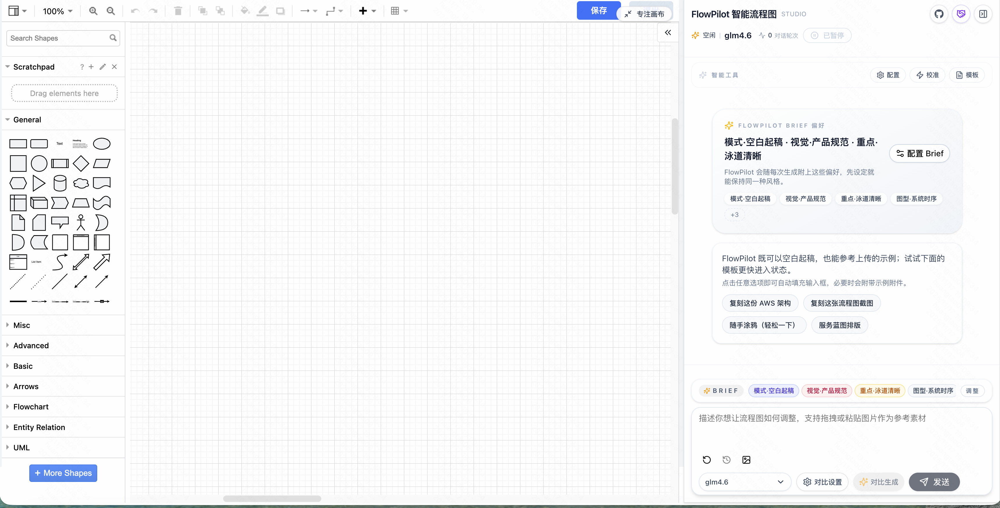


### Feature 1: Conversational Generation + Real-time Preview

> Chat with AI to iteratively create and refine your diagrams

| Initial Request: "Please draw a cat" | Follow-up: "Draw a dog next to it" |
|--------------------------------------|------------------------------------|
| 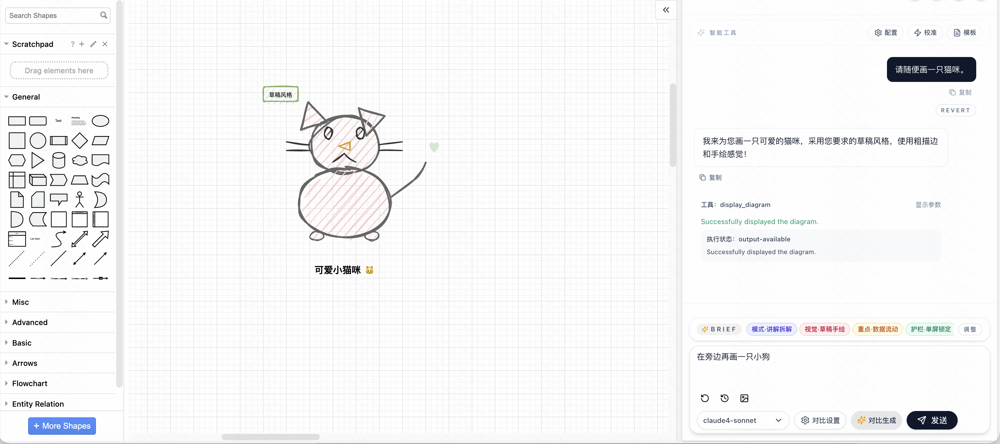            | 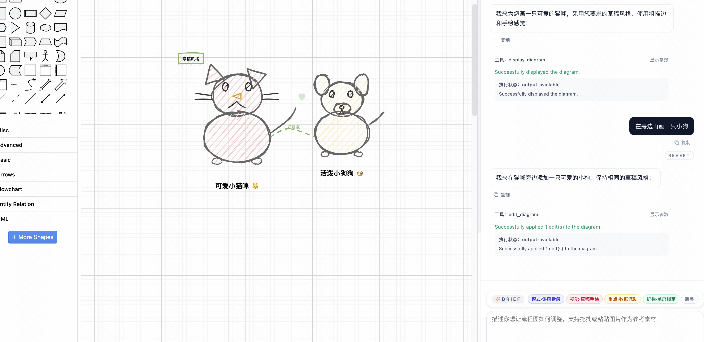         |

### Feature 2: Style Replication

> Upload a reference image, and FlowPilot will replicate its style

| Original Reference               | AI Generated with Same Style       |
|----------------------------------|------------------------------------|
| 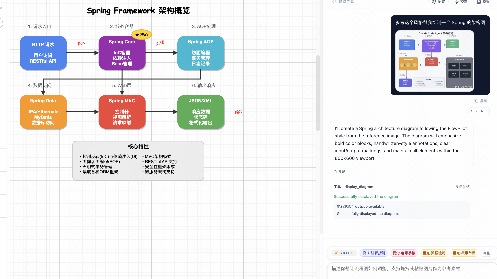 | 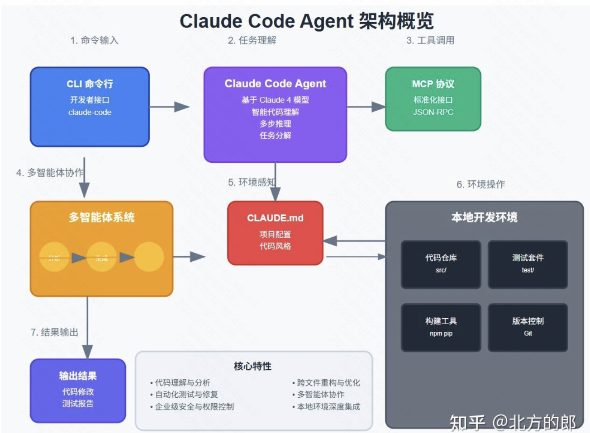 |

### Feature 3: FlowPilot Brief - Style Configuration

> Configure your diagram preferences once, apply to all generations

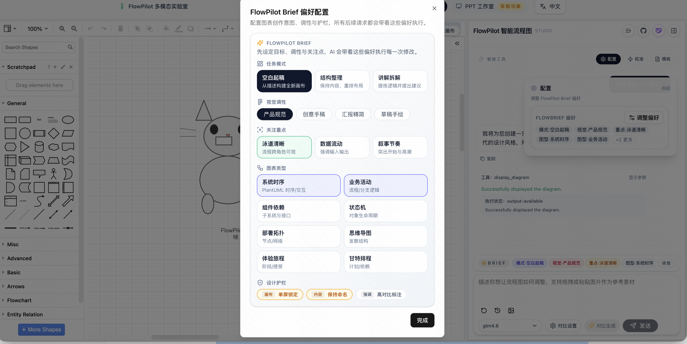

**Visual Style Comparison:**

| Formal Sequence Diagram         | Sketch-Style Sequence Diagram   |
|---------------------------------|---------------------------------|
| 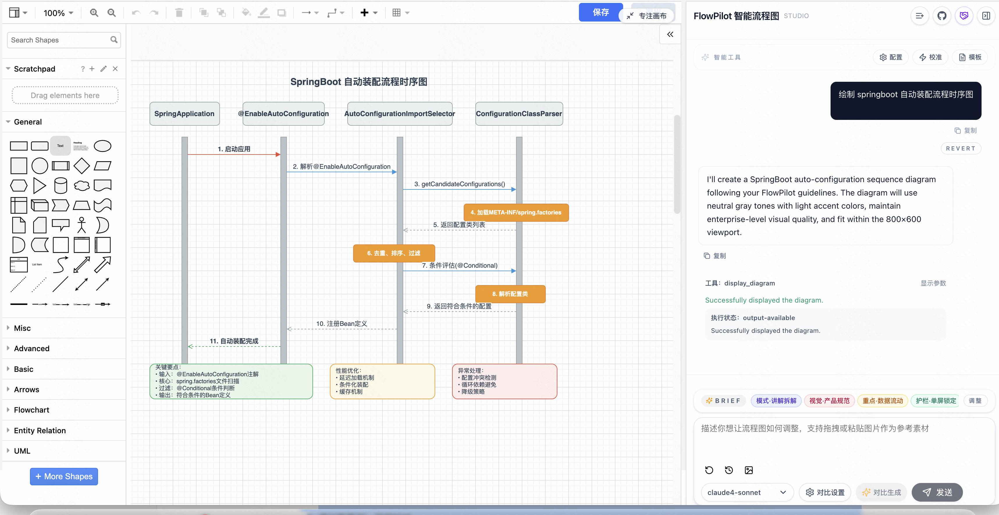 | 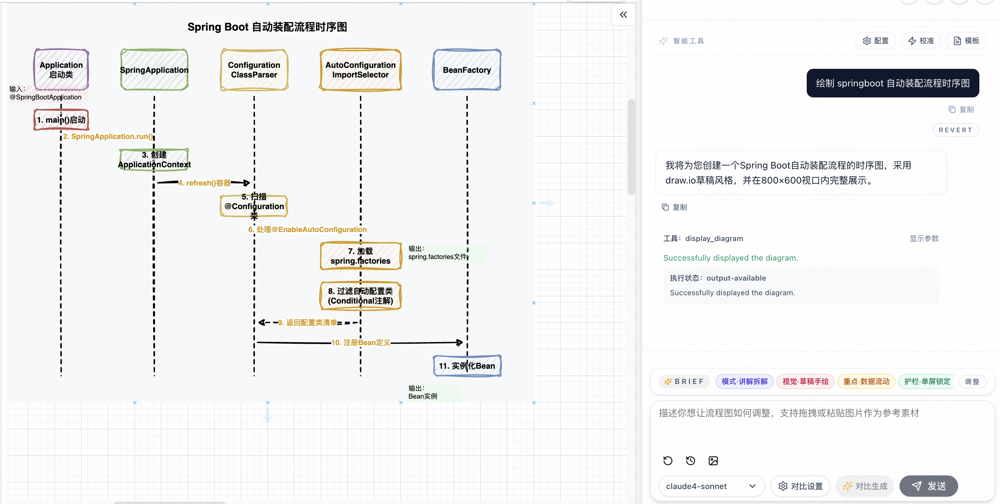 |

### Feature 4: Multi-Model Comparison

> Compare up to 5 LLMs side-by-side, choose the best result

| Model Selection                       | Comparison Results                  |
|---------------------------------------|-------------------------------------|
| 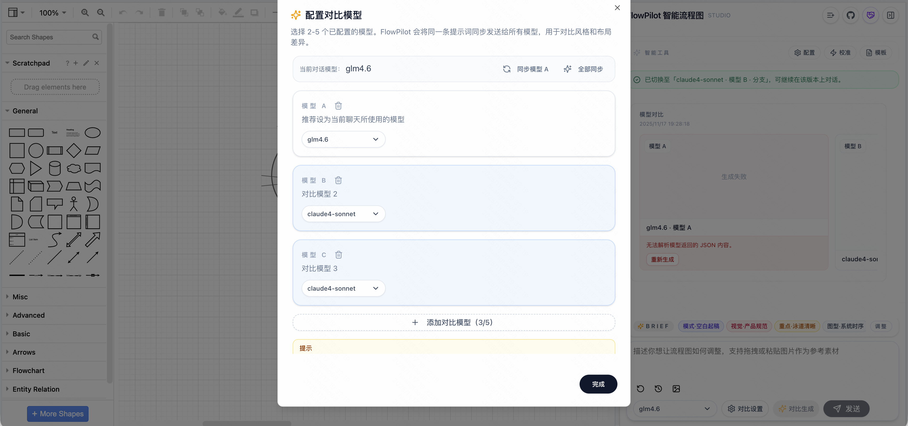 | 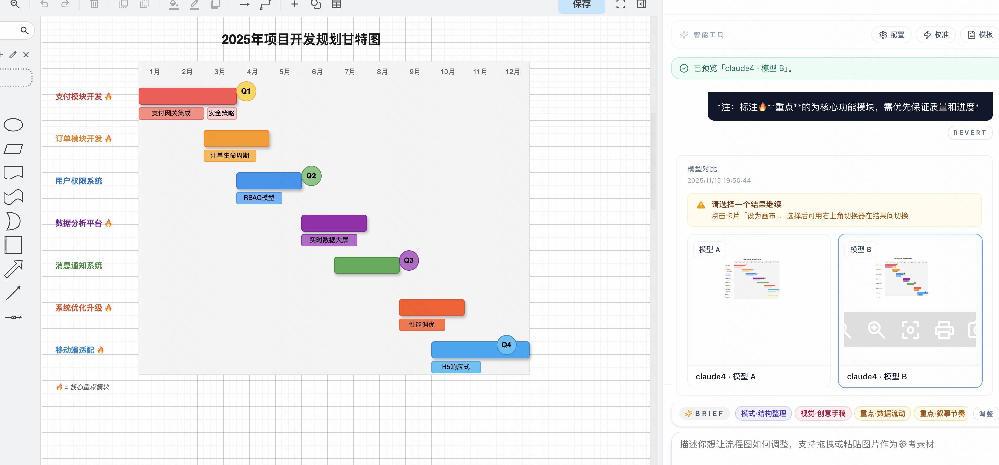 |

### Feature 5: Third-Party Model Configuration

> Easily configure custom API endpoints and models

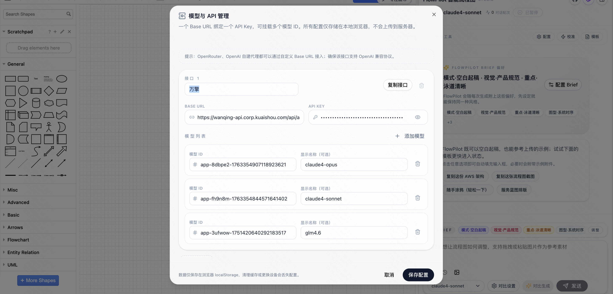

### Feature 6: PPT Generator (Beta)

> Experimental feature: Generate PowerPoint presentations with AI

| PPT Input                          | Generated Slides                    |
|------------------------------------|-------------------------------------|
| 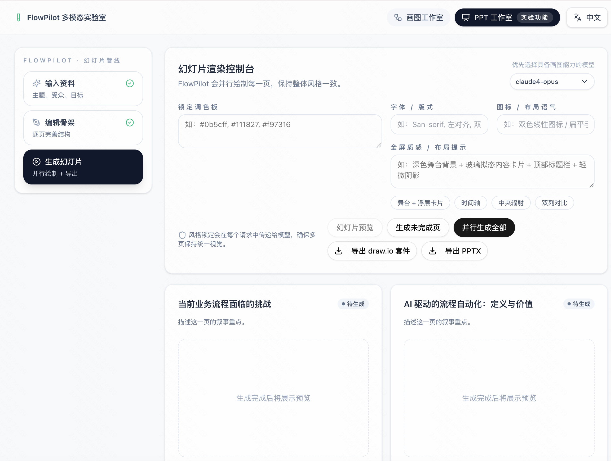 | 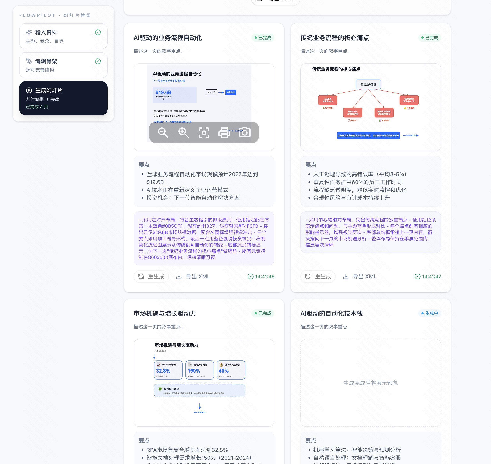 |

### Real-World Diagram Examples

> Various flowcharts, sequence diagrams, and system architectures generated by FlowPilot

<div align="center">

| Example 1                                                | Example 2                                                |
|----------------------------------------------------------|----------------------------------------------------------|
| 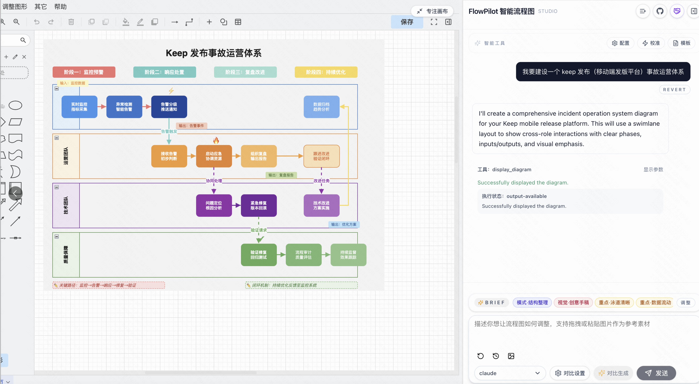                       | 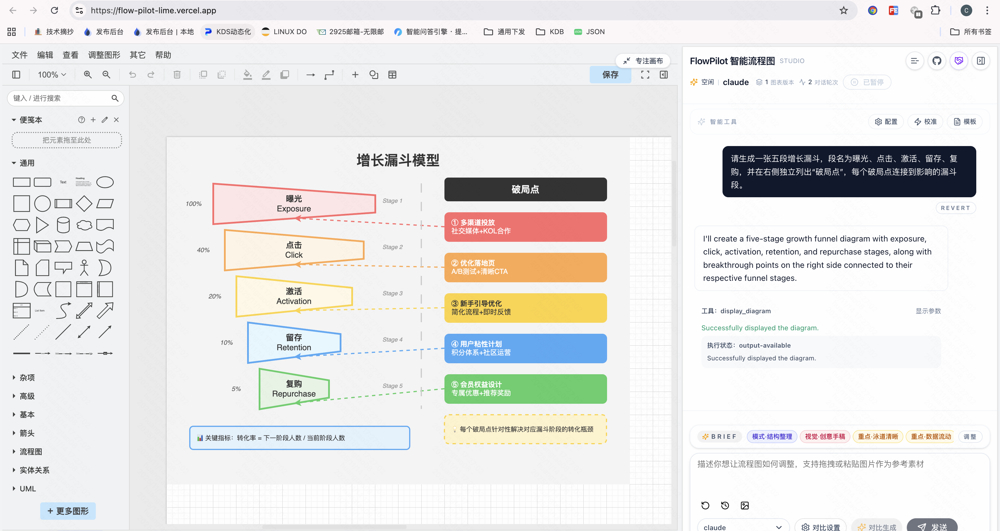                       |
| 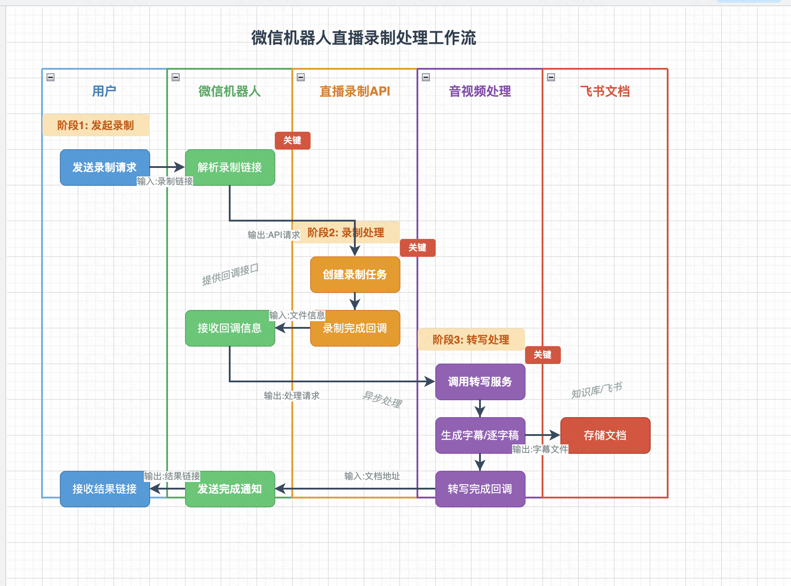                       | 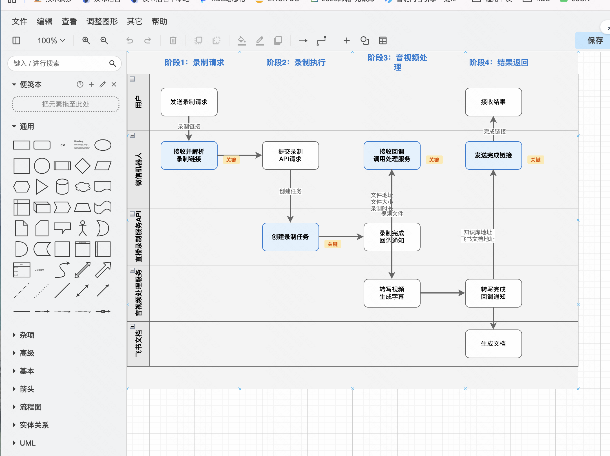                       |

</div>

### Architecture Diagram Example


*This diagram was also generated using FlowPilot!*

## 🚀 Quick Start

### Prerequisites

- Node.js 18+
- pnpm (recommended) or npm
- API Key from any supported LLM provider

### Installation

```bash
# Clone the repository
git clone https://github.com/yourusername/flowpilot.git
cd flowpilot

# Install dependencies
pnpm install

# Copy environment configuration
cp env.example .env.local

# Configure your API Key in .env.local
# See configuration details below
```

### Configuration

Edit `.env.local` file and add your API credentials:

```env
# Example: Using OpenAI
OPENAI_API_KEY=your-api-key-here

# Example: Using Google Gemini
GOOGLE_GENERATIVE_AI_API_KEY=your-api-key-here

# Example: Using Amazon Bedrock
AWS_ACCESS_KEY_ID=your-access-key
AWS_SECRET_ACCESS_KEY=your-secret-key
AWS_REGION=us-east-1

# Optional: Custom draw.io URL
NEXT_PUBLIC_DRAWIO_BASE_URL=https://embed.diagrams.net
```

### Launch Application

```bash
# Development mode
pnpm dev

# Production build
pnpm build
pnpm start
```

Visit `http://localhost:6002` in development mode, or `http://localhost:6001` in production

## 🎮 User Guide

### Step 1 - Configure Model

1. Click the **"Model Configuration"** button in the top right
2. Fill in model provider information:
    - **Base URL**: API endpoint (e.g., `https://api.openai.com/v1`)
    - **API Key**: Your authentication key
    - **Model ID**: Model identifier (e.g., `gpt-4`, `claude-3-opus`)

### Step 2 - Set Preferences (Optional)

Click **"FlowBrief"** to configure:
- Task Mode (Blank Canvas, Structure Refinement, Analysis & Explanation)
- Visual Style (Product Specification, Creative Sketch, Presentation, Hand-drawn)
- Focus Area (Clear Swimlanes, Data Flow, Narrative Rhythm)
- Diagram Type (Sequence, Activity, Component, State Machine, etc.)

### Step 3 - Start Creating

**Method A**: Describe in natural language
```
"Draw a user authentication flow with login, registration, and password reset"
```

**Method B**: Use templates
- Click the **"Templates"** button
- Select a preset diagram type
- Customize as needed

### Step 4 - Multi-Model Comparison (Optional)

1. Click **"Model Comparison"**
2. Select up to 5 models to compare
3. Generate diagrams in parallel
4. Pick the best result and apply to canvas

## 🛠️ Tech Stack

- **Framework**: Next.js 15 with App Router
- **Language**: TypeScript 5
- **Styling**: Tailwind CSS 4
- **AI SDK**: Vercel AI SDK
- **LLM Providers**:
    - OpenAI (GPT-4, GPT-3.5)
    - Anthropic Claude
    - Google Gemini
    - Amazon Bedrock
    - OpenRouter
- **Diagram Engine**: react-drawio
- **UI Components**: Radix UI
- **State Management**: React Context

## 📚 Supported LLMs

FlowPilot natively supports multiple LLM providers:

| Provider | Models | Notes |
|----------|--------|-------|
| OpenAI | GPT-4, GPT-3.5 Turbo | Recommended for general use |
| Anthropic | Claude 3 (Opus, Sonnet, Haiku) | Great for complex diagrams |
| Google | Gemini Pro, Gemini Pro Vision | Excellent with image references |
| Amazon Bedrock | Claude, Titan | Enterprise choice |
| OpenRouter | Various models | One-stop access to multiple models |

## 📖 Documentation

- [Architecture Guide](./docs/architecture.md) - System architecture and design decisions
- [i18n Guide](./docs/i18n-guide.md) - Multi-language implementation
- [PPT Studio](./docs/ppt-studio.md) - PowerPoint generation feature (Beta)

## 🎨 FlowPilot Brief Configuration

FlowPilot concatenates configured prompts from the "Brief" section into the system prompt before each LLM call. Here are the available options:

### Task Mode

- **Blank Canvas**: Build complete diagrams from scratch with proper zones and node naming
- **Structure Refinement**: Keep existing content, focus on alignment, grouping, and rhythm
- **Analysis & Explanation**: Prioritize summarizing current canvas logic, output insights and improvement suggestions

### Visual Style

- **Product Specification**: Neutral grays with light colors, maintaining enterprise product quality
- **Creative Sketch**: Bolder color blocks with handwritten annotations, emphasizing inspiration
- **Presentation**: Controlled element count, top-right whitespace, suitable for direct projection
- **Hand-drawn**: Switch to sketch theme with rough strokes, light sketch colors, and handwritten font style

### Focus Area

- **Clear Swimlanes**: Strengthen swimlane boundaries, highlight cross-role interactions
- **Data Flow**: Mark input/output for each step, maintain consistent arrow direction
- **Narrative Rhythm**: Add phase titles and key node markers, make flow more story-like

### Diagram Types

- **Sequence Diagram**: Convert main services/roles into sequence lifelines
- **Activity Diagram**: Express conditional branches and parallel merges
- **Component Diagram**: Emphasize subsystems, interface contracts, and deployment boundaries
- **State Machine**: Display core object state transitions
- **Deployment Topology**: Output deployment diagram with environment nodes and network relations
- **Mind Map**: Organize topics, branches, and sub-points in mind map format
- **Customer Journey**: Show stages, touchpoints, and emotional curves from customer perspective
- **Gantt Chart**: Draw simplified Gantt with milestones, durations, and dependencies

## 💡 Tips & Best Practices

### Model Selection

- **Recommended Models**: Claude 4.5 Sonnet, Claude-4 perform well for flowchart structures and connections
- **Image References**: Use vision-capable models for screenshot/reference image needs
- **Iterative Refinement**: First versions are usually rough, expect several rounds of "fine-tune/beautify/reorganize" to achieve satisfaction

### Prompt Writing Tips

- **Clear Intent**: Tell the model your business scenario, expected diagram type, and roles
- **Diverse Materials**: Directly paste draw.io XML, Mermaid, PlantUML, code snippets as references
- **Progressive Optimization**: Continue conversations like "keep nodes unchanged, only beautify layout" or "change swimlanes to vertical"

### Common Scenarios

| Scenario | Example Prompt |
|----------|---------------|
| Product Flow | `Draw a swimlane diagram for streamer go-live to sales settlement, with lanes: streamer, operations, inventory, finance; highlight key approval nodes` |
| Technical Architecture | `Draw "short video recommendation pipeline" system diagram, with layers: collection, features, recall, ranking, service; use right-angle connectors` |
| Operations SOP | `Output content submission-review-publish SOP, emphasize responsible roles, input artifacts, approval conditions` |
| Incident Response | `Draw service degradation flow: monitoring alert → on-call → SRE → business owner, highlight key SLAs in red` |

## 🤝 Contributing

Pull requests are welcome!

1. Fork the repository
2. Create your feature branch (`git checkout -b feature/AmazingFeature`)
3. Commit your changes (`git commit -m 'Add some AmazingFeature'`)
4. Push to the branch (`git push origin feature/AmazingFeature`)
5. Open a Pull Request

## 📝 License

This project is licensed under the MIT License - see the [LICENSE](LICENSE) file for details

## 🙏 Acknowledgments

This project is built upon [next-ai-draw-io](https://github.com/DayuanJiang/next-ai-draw-io). Special thanks to DayuanJiang for creating such an excellent foundation.

## 📧 Contact

For questions, suggestions, or feedback, please open an issue on GitHub.

## ⭐ Star History

If FlowPilot helps you, please give it a Star!

---

<div align="center">
Built with ❤️ by FlowPilot Team
</div>
